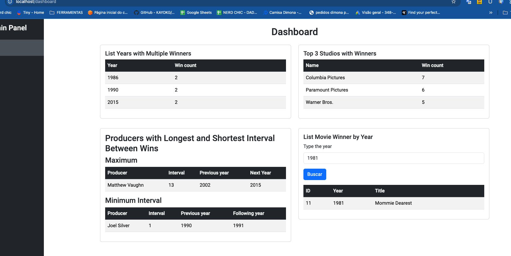

Claro! Aqui está a versão mais estilizada e detalhada do seu **README**:

---

# **outsera-test-rh**
Teste solicitado pela cia **Outsera**



---

## **Iniciar o Projeto Localmente**

Este guia irá ajudá-lo a configurar e rodar o projeto localmente utilizando **Docker** e **Docker Compose**.

---

## **Requisitos**

Antes de começar, certifique-se de ter os seguintes requisitos instalados:

- **Docker**: [Instruções de instalação do Docker](https://docs.docker.com/get-docker/)
- **Docker Compose**: [Instruções de instalação do Docker Compose](https://docs.docker.com/compose/install/)

---

## **Passos para Executar Localmente**

### **1. Build da Aplicação**

Para construir as imagens Docker do projeto, execute o seguinte comando:

```bash
docker-compose build
```

### **2. Subir a Aplicação**

Após o build, execute o comando abaixo para subir os containers da aplicação:

```bash
docker-compose up --build
```


## **Acessando o Projeto**

Após a execução dos containers, você poderá acessar as seguintes URLs:

### **Frontend (Angular)**

Abra o seu navegador e acesse a interface do usuário:

```
http://localhost/dashboard
```

### **API (C# .NET)**

Para acessar a API e listar todos os filmes, use o seguinte endpoint:

```
http://localhost:5001/api/movies
```

Para visualizar os intervalos dos produtores de filmes, use:

```
http://localhost:5001/api/Movies/producers/intervals
```

### **Swagger - Teste a API de Forma Interativa**

Você também pode testar a API de forma interativa através do **Swagger**, acessando o seguinte link:

```
http://localhost:5001/swagger/index.html
```

---

## **Parando o Projeto**

Para parar os containers do Docker, execute o seguinte comando:

```bash
docker-compose down
```

Isso irá parar e remover os containers, mas manterá as imagens construídas.

---

## **Problemas Comuns**

- **Problema**: Não consigo acessar as URLs.
  - **Solução**: Verifique se o Docker está rodando corretamente e se não há conflitos de portas.

- **Problema**: O Docker Compose não está funcionando.
  - **Solução**: Certifique-se de ter o Docker e Docker Compose corretamente instalados. Execute `docker-compose --version` para verificar se o Docker Compose está instalado corretamente.

---
😄 rpa